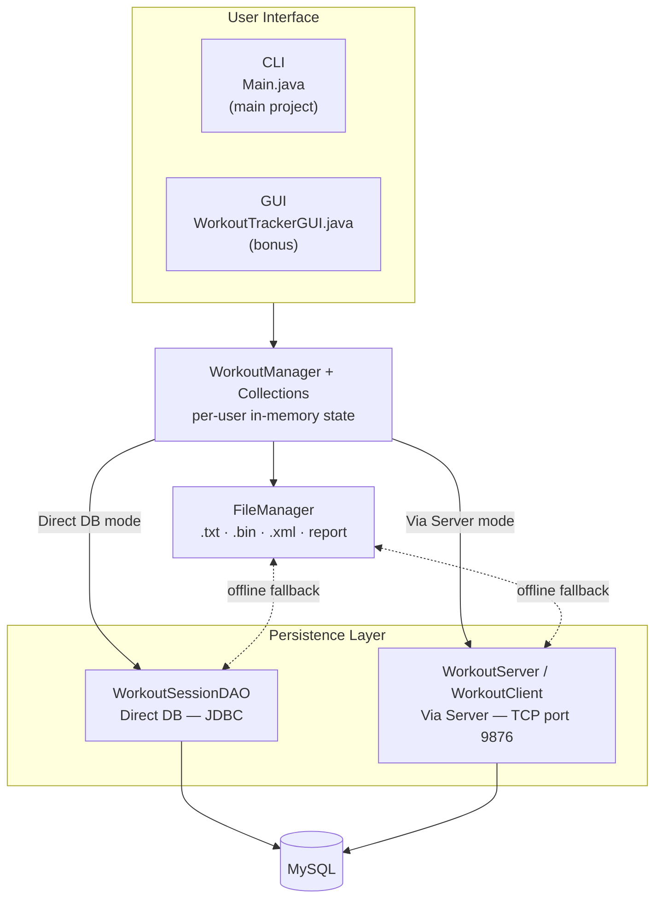
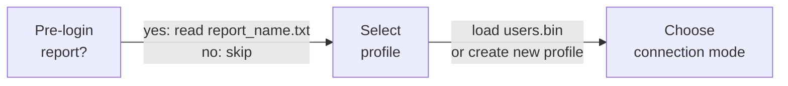
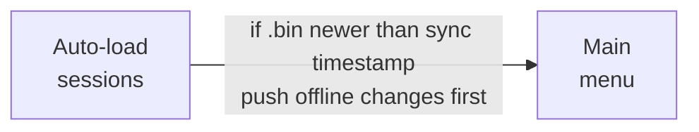
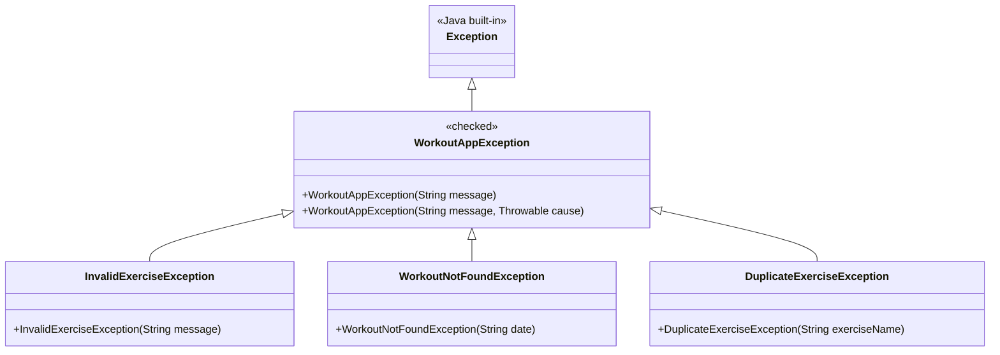

# Presentation Diagrams — Mermaid Source

Each diagram is labelled with the slide it belongs to.
Paste the code block content into any Mermaid renderer (mermaid.live, Notion, Obsidian, etc.).

---

## Diagram 1 — Architecture Stack (Slide 1)

---

## Diagram 2a — Startup Flow: Identity & Connection (Slide 2, top)

---

## Diagram 2b — Startup Flow: Data & Menu (Slide 2, bottom)

---

## Diagram 3 — Exception Hierarchy (Slide 3)

